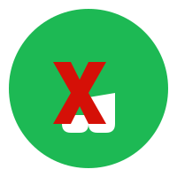
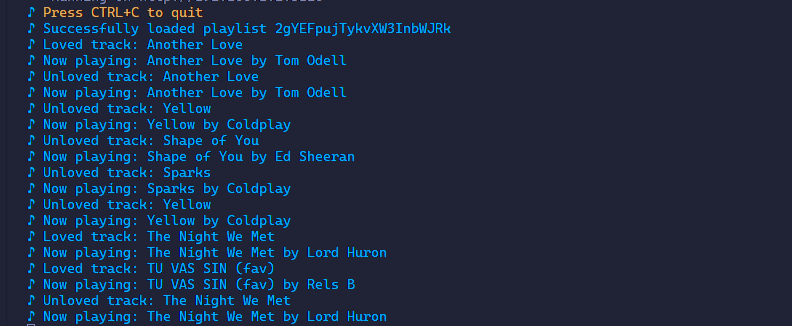

<h1 align="center">
  <br>
  <a href="https://github.com/dredyne/auto-scrobbler"></a>
  <br>
  Auto Scrobbler
  <br>
</h1>

<h4 align="center">A powerful automatic music scrobbler built with Python, powered by <a href="https://www.spotify.com" target="_blank">Spotify</a> and <a href="https://www.last.fm" target="_blank">Last.fm</a>.</h4>

<p align="center">
  <a href="https://github.com/dredyne/auto-scrobbler/issues">
    
  </a>  
  <a href="https://github.com/dredyne/auto-scrobbler/pulls">
    
  </a>
  <a href="https://discord.gg/UPyggZ2cK8">
    
  </a>
  <a href="https://github.com/dredyne/auto-scrobbler/graphs/contributors">
    
  </a>
  <a href="https://github.com/sponsors/dredyne">
    
  </a>
</p>


<p align="center">
  <a href="#-key-features">Key Features</a> •
  <a href="#-how-to-use">How To Use</a> •
  <a href="#-credits">Credits</a> •
  <a href="#-support">Support</a> •
  <a href="#-contributing">Contributing</a> •
  <a href="#-license">License</a>
</p>

<p align="center">
  
</p>

## 🌟 Key Features

* Automatic Scrobbling
  - Continuously scrobbles tracks from Spotify playlists to Last.fm
  - Intelligent track selection and timing
* Smart Love/Unlove
  - Automatically loves or unloves tracks based on intelligent algorithms
* Error Recovery
  - Robust error handling and automatic recovery
  - Detailed logging for troubleshooting
* Keep-Alive System
  - Built-in web server ensures continuous operation
  - Automatic restart on crashes
* Configuration Management
  - Environment-based configuration
  - Secure credential handling
* Cross platform
  - Windows, macOS and Linux ready

## 🚀 How To Use

To clone and run this application, you'll need [Git](https://git-scm.com), [Python 3.8+](https://www.python.org/downloads/), and [Poetry](https://python-poetry.org/) installed on your computer. From your command line:

```bash
# Clone this repository
$ git clone https://github.com/yourusername/auto-scrobbler

# Go into the repository
$ cd auto-scrobbler

# Install dependencies using Poetry
$ poetry install

# Copy the environment template and fill in your credentials
$ cp .env_template .env

# Update the playlist IDs in `main.py` with your desired Spotify playlists

# Run the app
$ poetry run python main.py
```

> **Note**
> Make sure to set up your `.env` file with proper credentials before running the application.

### 📜 Logging

Logs are stored in `logs/auto_scrobble.log`. The log level can be configured in the `.env` file.

### 🕛 Error Handling

The application includes robust error handling:
- Automatic retry mechanism for failed scrobbles
- One-hour wait period after consecutive failures
- Detailed error logging

## ⚡ You may also like...

- [NeuralRoulette-AI](https://github.com/dredyne/NeuralRoulette-AI) - An advanced machine learning system for predicting roulette outcomes.

## 🙏 Credits

This software uses the following open source packages:

- [Spotipy](https://spotipy.readthedocs.io/) - Lightweight Python library for the Spotify Web API
- [PyLast](https://github.com/pylast/pylast) - Python interface to Last.fm
- [Flask](https://flask.palletsprojects.com/) - Lightweight WSGI web application framework
- [Python-Dotenv](https://github.com/theskumar/python-dotenv) - Environment variables management

## 🤝 Contributing

Contributions are welcome! Please feel free to submit a Pull Request.

## 🤍 Support

If you like this project and think it has helped in any way, consider buying me a coffee!

<a href="https://www.buymeacoffee.com/yourusername" target="_blank"></a>

## 📝 License

This project is licensed under the MIT License - see the [LICENSE](LICENSE) file for details.

---

<div align="center"><sub>

Built with ❤️ by [dredyne](https://github.com/dredyne)</sub></div>
